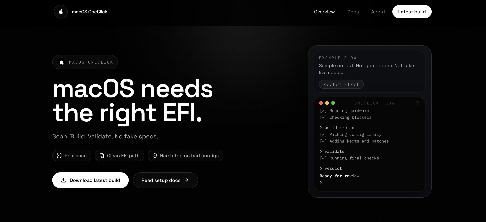

# macOS One-Click

 

---

> **Advanced macOS deployment utility for PC hardware. Professional performance through simplified engineering.**

macOS One-Click automates the Hackintosh setup process by analyzing system hardware and fetching compatible OpenCore components. It retrieves resources directly from Apple servers and handles complex firmware configurations with persistent progress tracking.

## Overview

| System | Purpose |
|---|---|
| Hardware Synthesis | Automatic generation of device-specific configuration |
| Direct Recovery | Direct streaming from official Apple infrastructure |
| Persistence | Download resumption across system restarts |
| Deployment | Installation to USB media or internal boot partitions |

## Security

Built according to OpenCore standards:
- **Vaulting** for bootloader integrity
- **SecureBootModel** for hardware-level trust
- **SIP** configuration to production defaults

---

**Developed by [redpersongpt](https://github.com/redpersongpt)**  &nbsp;·&nbsp;  [Follow on X](https://x.com/redpersongpt)

